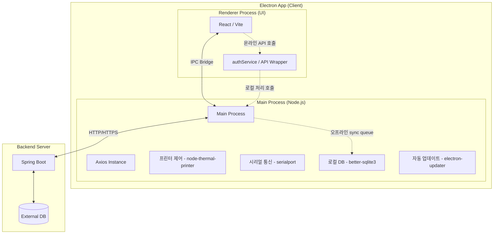
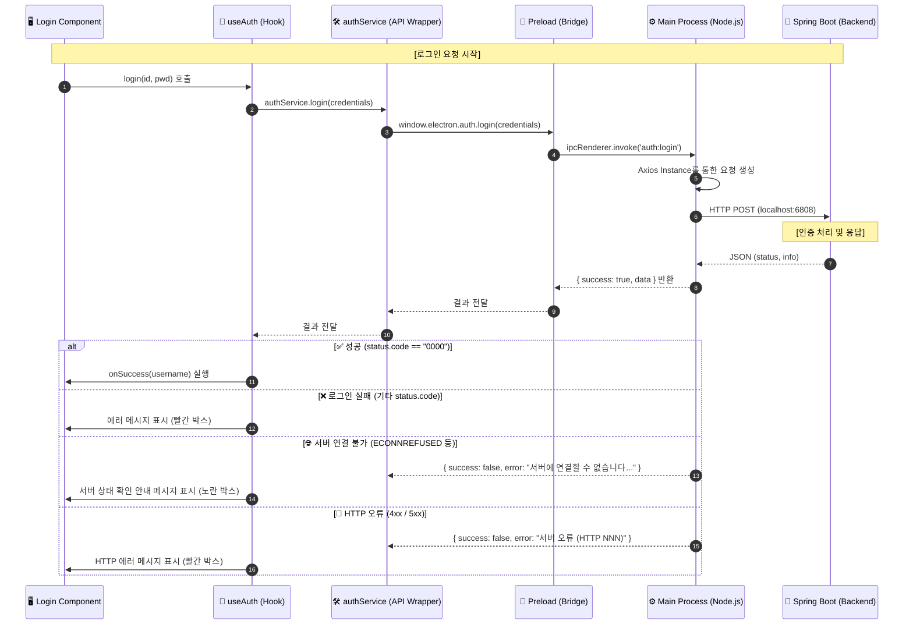

# Electron POS Project

---

## 🛠 기술 스택 및 라이브러리

- **Language**: [TypeScript](https://www.typescriptlang.org/)
- **Frontend Framework**: [React 19](https://react.dev/)
- **Desktop Framework**: [Electron 41](https://www.electronjs.org/)
- **Build Tool**: [Vite 5](https://vitejs.dev/)
- **Package Manager**: [pnpm](https://pnpm.io/)
- **Bundler/Packager**: [Electron Forge](https://www.electronforge.io/)

---

## 💻 1. 개발 환경 세팅 (Setup)

### 1.1 Node.js 설치
- [nodejs.org](https://nodejs.org/)에서 LTS 버전을 설치합니다.
- 설치 확인: `node -v`

### 1.2 IDE 세팅 (VS Code / Cursor)
- 별도의 전용 확장 없이 기존 JavaScript/TypeScript 확장으로 개발 가능합니다.

### 1.3 pnpm 사용 시 추가 설정 (.npmrc)
pnpm은 심볼릭 링크 방식으로 패키지를 관리하기 때문에 electron-forge가 의존성 탐색에 실패할 수 있습니다. 프로젝트 루트에 `.npmrc` 파일이 아래 설정을 포함하고 있는지 확인하세요.
```text
node-linker=hoisted
```

### 1.4 의존성 설치 및 실행
```bash
# 의존성 설치
pnpm install

# 개발 모드 실행 (Hot Reload 지원)
pnpm dev
```

---

## 📂 2. 프로젝트 구조 (Structure)

Electron의 보안 및 성능 모범 사례에 따라 계층화된 아키텍처를 가지고 있습니다.

```text
electron_test/
├── src/
│   ├── main/           # 메인 프로세스 (Node.js 환경)
│   │   ├── api/        # Main 전용 API 서비스 (Axios Instance, IPC 핸들러)
│   │   │   ├── axiosInstance.ts # 백엔드 통신용 Axios 설정
│   │   │   └── ipcHandlers.ts   # Renderer의 요청을 처리하는 IPC 리스너
│   │   └── main.ts     # 앱 생명주기 및 브라우저 윈도우 관리
│   ├── preload/        # 프리로드 스크립트 (Main과 Renderer 사이의 가교)
│   │   └── preload.ts  # 안전한 IPC 통신 설정 (ContextBridge)
│   └── renderer/       # 렌더러 프로세스 (React UI 환경)
│       ├── api/        # Renderer 전용 서비스 (IPC 호출 래퍼 - authService.ts 등)
│       ├── components/ # React 컴포넌트 및 스타일 (Login, TicketSales 등)
│       ├── hooks/      # Custom Hooks (비즈니스 로직 분리 - useAuth.ts 등)
│       ├── types/      # TypeScript 타입 정의 (auth.ts, electron.d.ts 등)
│       ├── App.tsx     # 메인 앱 컴포넌트 및 라우팅 로직
│       └── renderer.tsx # React 진입점 (DOM 렌더링)
├── forge.config.ts     # Electron Forge 설정 파일
├── index.html          # 메인 HTML 템플릿
├── package.json        # 의존성 및 스크립트 정의
└── tsconfig.json       # TypeScript 설정
```

---

## 🏗️ 3. 전체 아키텍처 및 연동 구조 (Architecture)

현재 프로젝트는 **Electron(Frontend/Client)**과 **Spring Boot(Backend/Server)**가 연동되는 구조로, 보안과 성능을 고려하여 역할이 분담되어 있습니다.



### 3.1 계층별 상세 역할

#### 1) Renderer Process (UI)
- **Framework**: React / Vite 기반 웹 UI
- **역할**: 사용자 접점(UI/UX), 데이터 입력 및 결과 표시
- **통신**: 보안을 위해 직접적인 외부 API 호출 대신 `ipcRenderer.invoke()`를 통해 Main Process에 요청을 위임합니다.

#### 2) Main Process (Node.js)
- **역할**: 앱의 생명주기 관리 및 하드웨어/시스템 자원 제어
- **핵심 기능**:
    - **프린터 제어**: 영수증 출력 등 (`node-thermal-printer`)
    - **시리얼 통신**: POS 주변기기(카드 단말기 등) 연결 (`serialport`)
    - **로컬 DB**: 오프라인 모드 지원 및 캐싱 (`better-sqlite3`)
    - **오프라인 Sync**: 네트워크 단절 시 데이터를 로컬에 큐잉 후 자동 동기화
    - **자동 업데이트**: 최신 버전 유지 (`electron-updater`)

#### 3) Spring Boot (Backend)
- **역할**: 중앙 집중식 데이터 관리 및 비즈니스 로직 처리
- **핵심 기능**:
    - **메뉴/재고 관리**: 마스터 데이터 관리
    - **매출/현황**: 전체 포스 데이터 집계
    - **멀티 포스 동기화**: 여러 단말기 간 데이터 정합성 유지

---

## 🔄 4. API 통신 프로세스 및 로직 (Process Logic)

현재 프로젝트는 보안을 위해 **IPC (Inter-Process Communication)** 방식을 사용합니다. 렌더러는 직접 통신하지 않고 메인 프로세스(Node.js)를 거쳐 백엔드와 통신합니다.

### 4.1 데이터 흐름도 (Data Flow)



### 4.2 계층별 핵심 역할 (Layer Responsibilities)

| 계층 (Layer) | 파일 위치 | 주요 역할 |
| :--- | :--- | :--- |
| **Component** | `src/renderer/components/` | **[사용자 접점]** UI 렌더링, 사용자 입력 수집 |
| **Hook** | `src/renderer/hooks/` | **[상태 관리]** UI 상태(로딩, 에러) 제어 및 비즈니스 로직 |
| **Service (Renderer)** | `src/renderer/api/` | **[IPC 래퍼]** Preload API를 호출하기 쉬운 함수로 래핑 |
| **Preload** | `src/preload/preload.ts` | **[보안 브릿지]** 메인과 렌더러 사이의 안전한 통로 제공 |
| **Main (Node.js)** | `src/main/api/` | **[네트워크/시스템]** 실제 API 호출 및 시스템 자원 접근 |

### 4.3 에러 처리 전략 (Error Handling)

API 통신 오류는 Main 프로세스(`ipcHandlers.ts`)에서 유형별로 분류 후 사용자 친화적 메시지로 변환됩니다.

| 오류 유형 | 조건 | 사용자 메시지 | UI 표시 |
| :--- | :--- | :--- | :--- |
| **서버 연결 불가** | `ECONNREFUSED`, `ETIMEDOUT`, `ERR_NETWORK` 등 | "서버에 연결할 수 없습니다. 서버 상태를 확인해주세요." | 노란 경고 박스 (⚠) |
| **HTTP 오류** | 4xx / 5xx 응답 | "서버 오류가 발생했습니다. (HTTP NNN)" 또는 서버 메시지 | 빨간 에러 박스 |
| **로그인 실패** | `info` 필드 비어있음 | "로그인 정보가 올바르지 않습니다." | 빨간 에러 박스 |
| **비정상 응답 코드** | `status.code != "0000"` | 서버 메시지 또는 "로그인 실패 (코드: NNN)" | 빨간 에러 박스 |
| **응답 구조 불일치** | `response.data` 미존재 | "서버 응답 형식이 올바르지 않습니다." | 빨간 에러 박스 |

---

## 🚀 5. 빌드 및 배포 (Build & Package)

### 5.1 애플리케이션 패키징
현재 플랫폼에 맞는 실행 파일만 생성합니다. (결과물: `out/`)
```bash
pnpm package
```

### 5.2 배포용 빌드 (Make)
설치 프로그램(Installer)을 생성합니다. (결과물: `out/make/`)
```bash
pnpm make
```

---

## 🎯 6. 빌드 타겟 옵션 (고급)

기본적으로 현재 머신의 플랫폼과 아키텍처로 빌드됩니다. 특정 환경을 위한 빌드가 필요할 경우 아래 옵션을 사용합니다.

### 6.1 특정 플랫폼 지정 (Electron Forge)
```bash
# Windows 전용 빌드
pnpm make --platform win32

# macOS 전용 빌드
pnpm make --platform darwin

# Linux 전용 빌드
pnpm make --platform linux
```

### 6.2 특정 아키텍처 지정
```bash
# x64 (64비트) 빌드
pnpm make --arch x64

# arm64 (Apple Silicon 등) 빌드
pnpm make --arch arm64
```
