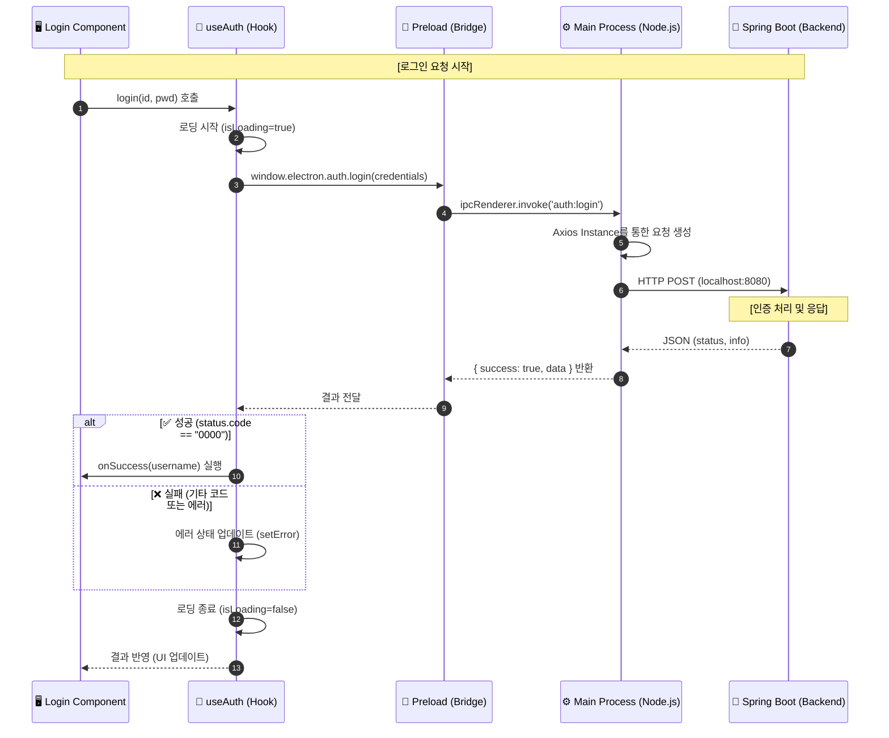

# Electron POS Test Project

---

## 🛠 기술 스택 및 라이브러리

- **Language**: [TypeScript](https://www.typescriptlang.org/)
- **Frontend Framework**: [React 19](https://react.dev/)
- **Desktop Framework**: [Electron 41](https://www.electronjs.org/)
- **Build Tool**: [Vite 5](https://vitejs.dev/)
- **Package Manager**: [pnpm](https://pnpm.io/)
- **Bundler/Packager**: [Electron Forge](https://www.electronforge.io/)

---

## 💻 1. 개발 환경 세팅 (Setup)

### 1.1 Node.js 설치
- [nodejs.org](https://nodejs.org/)에서 LTS 버전을 설치합니다.
- 설치 확인: `node -v`

### 1.2 IDE 세팅 (VS Code / Cursor)
- 별도의 전용 확장 없이 기존 JavaScript/TypeScript 확장으로 개발 가능합니다.

### 1.3 pnpm 사용 시 추가 설정 (.npmrc)
pnpm은 심볼릭 링크 방식으로 패키지를 관리하기 때문에 electron-forge가 의존성 탐색에 실패할 수 있습니다. 프로젝트 루트에 `.npmrc` 파일이 아래 설정을 포함하고 있는지 확인하세요.
```text
node-linker=hoisted
```

### 1.4 의존성 설치 및 실행
```bash
# 의존성 설치
pnpm install

# 개발 모드 실행 (Hot Reload 지원)
pnpm dev
```

---

## 📂 2. 프로젝트 구조 (Structure)

Electron의 보안 및 성능 모범 사례에 따라 계층화된 아키텍처를 가지고 있습니다.

```text
electron_test/
├── src/
│   ├── main/           # 메인 프로세스 (Node.js 환경)
│   │   ├── api/        # Main 전용 API 서비스 (Axios, IPC 핸들러)
│   │   └── main.ts     # 앱 생명주기 및 브라우저 윈도우 관리
│   ├── preload/        # 프리로드 스크립트 (Main과 Renderer 사이의 가교)
│   │   └── preload.ts  # 안전한 IPC 통신 설정 (ContextBridge)
│   └── renderer/       # 렌더러 프로세스 (React UI 환경)
│       ├── api/        # Renderer 전용 서비스 (IPC 호출 래퍼)
│       ├── components/ # React 컴포넌트 및 스타일 (Login 등)
│       ├── hooks/      # Custom Hooks (비즈니스 로직 분리)
│       ├── types/      # TypeScript 타입 정의 (공통 인터페이스)
│       ├── App.tsx     # 메인 앱 컴포넌트 및 라우팅 로직
│       ├── renderer.tsx # React 진입점 (DOM 렌더링)
│       └── ...         # CSS 및 기타 에셋
├── forge.config.ts     # Electron Forge 설정 파일
├── index.html          # 메인 HTML 템플릿
├── package.json        # 의존성 및 스크립트 정의
└── tsconfig.json       # TypeScript 설정
```

---

## 🔄 3. API 통신 프로세스 및 로직 (Process Logic)

현재 프로젝트는 보안을 위해 **IPC (Inter-Process Communication)** 방식을 사용합니다. 렌더러는 직접 통신하지 않고 메인 프로세스(Node.js)를 거쳐 백엔드와 통신합니다.

### 3.1 데이터 흐름도 (Data Flow)



### 3.2 계층별 핵심 역할 (Layer Responsibilities)

| 계층 (Layer) | 파일 위치 | 주요 역할 |
| :--- | :--- | :--- |
| **Component** | `src/renderer/components/` | **[사용자 접점]** 입력값 수집, 로딩/에러 UI 표시 |
| **Hook** | `src/renderer/hooks/` | **[상태 관리]** UI 상태 제어, IPC 호출 흐름 관리 |
| **Preload** | `src/preload/preload.ts` | **[보안 브릿지]** 메인과 렌더러 사이의 안전한 통로 제공 |
| **Main (Node.js)** | `src/main/api/` | **[네트워크/시스템]** 실제 API 호출, 시스템 자원 접근 |
| **Axios (Main)** | `src/main/api/` | **[네트워크 설정]** Node.js 환경에서의 Axios 설정 및 헤더 관리 |

---

## 🚀 빌드 및 배포 (Build & Package)

### 애플리케이션 패키징
현재 플랫폼에 맞는 실행 파일만 생성합니다. (결과물: `out/`)
```bash
pnpm package
```

### 배포용 빌드 (Make)
설치 프로그램(Installer)을 생성합니다. (결과물: `out/make/`)
```bash
pnpm make
```

---

## 🎯 빌드 타겟 옵션 (고급)

기본적으로 현재 머신의 플랫폼과 아키텍처로 빌드됩니다.

### Windows 빌드 타겟 예시
```bash
# x64 (기본값)
pnpm electron-builder --win --x64
# ia32 (32비트)
pnpm electron-builder --win --ia32
```

### macOS 빌드 타겟 예시
```bash
# Apple Silicon (M1 이후)
pnpm electron-builder --mac --arm64
# Universal Binary
pnpm electron-builder --mac --universal
```

---

## 🏗️ 전체 아키텍처 다이어그램

```
┌─────────────────────────────────────────────────────┐
│                  Electron App                       │
│                                                     │
│  ┌─────────────────────────────────────────────┐    │
│  │         Renderer Process (UI)               │    │
│  │         React / Vite / Axios (Wrapper)      │    │
│  │                                             │    │
│  │  IPC Call → Main Process (Node.js)          │    │
│  └──────────────┬──────────────────────────────┘    │
│                 │ IPC (contextBridge)               │
│  ┌──────────────▼──────────────────────────────┐    │
│  │         Main Process (Node.js)              │    │
│  │                                             │    │
│  │  - 실제 API 호출 (Axios)                    │    │
│  │  - 프린터 제어 / 시리얼 통신 / 로컬 DB      │    │
│  │  - 자동 업데이트 (electron-updater)         │    │
│  └──────────────┬──────────────────────────────┘    │
└─────────────────┼───────────────────────────────────┘
                  │ HTTP
       ┌──────────▼──────────┐
       │    Spring Boot      │
       │  - 매출/현황/재고   │
       └──────────┬──────────┘
                  │
             ┌────▼────┐
             │   DB    │
             └─────────┘
```
